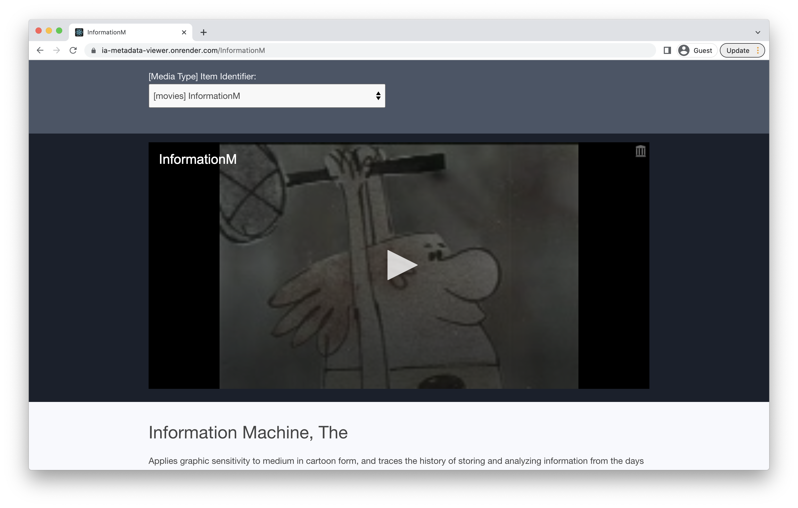

# Simple IA Metadata App
### Demo: https://ia-metadata-viewer.onrender.com/
This app displays the metadata, reviews, and related items for any item in the internet archive.

Requirements:  [Front-End Coding Challenge](https://docs.google.com/document/d/19tGoS6RbJcLhnYHsFmjFmRIyuHi6NtKIAWjglE6pE2w/edit#).


## Run Locally
### `yarn install`
Installs dependencies.

### `yarn start`
Runs the app in the development mode at `http://localhost:3000/`
  
## Run Tests
### `CI=true yarn test`
Runs the unit tests. 
### `CI=true yarn test --coverage`
Display Jest'sintegrated coverage reporter. 
  
## Build

### `npm run build`

Builds the app for production to the `build` folder.\
If you wish to serve it from the `build` folder locally, 
```
yarn global add serve
serve -s build
```

## Deploy 
This app is deployed using https://render.com/.  
Pushing to `main` on this repo will trigger an automatic deploy.\
If you would like to skip automatic deploy for a specific commit, include a skip phrase in the commit message.
  
The skip phrase must be in the form of `[<KEYWORD> skip]` or `[skip <KEYWORD>]`.\
Where `KEYWORD` should be one of `render`, `deploy`, or `cd`.

Example:
```
[render skip] Update README
```


---
## Using the App   
Items may also be accessed with this URL pattern:\
http://localhost:3000/{itemIdentifier}  
https://ia-metadata-viewer.onrender.com/{itemIdentifier}  
  
The dropdown contains sample items of each [media type](https://archive.org/services/docs/api/metadata-schema/index.html#mediatype). 
  
Note that the iFrame media embed will only display for `texts`, `movies`, `software`, and `image` media types.  
  

  

  
---

